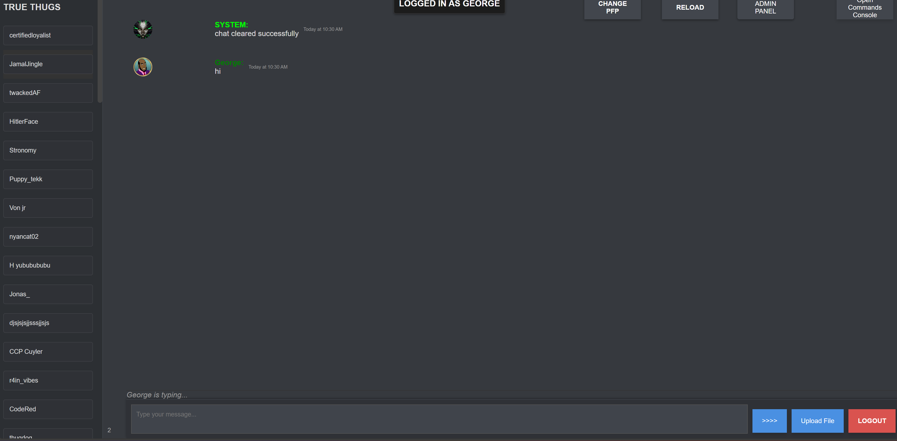

# THUG-CHAT

**THUG-CHAT** is an engaging real-time chat application designed for seamless communication in a sleek and modern interface. Whether you’re catching up with friends or collaborating with colleagues, THUG-CHAT provides an intuitive platform for all your messaging needs.

## Features

- **Real-Time Messaging**: Enjoy instant messaging powered by Socket.io, ensuring your conversations are always in the moment.
- **User Management**: Easily view and interact with a list of active users to stay connected.
- **File Uploads**: Share images, videos, and audio files directly in your chats—no hassle, just click and send.
- **Typing Indicators**: Know when someone is crafting their reply with real-time typing indicators.
- **Message Formatting**: Enhance your messages with text formatting and link previews to make conversations more dynamic.

## Technologies Used

- **Frontend**: HTML, CSS, JavaScript
- **Backend**: Flask, Python
- **Real-Time Communication**: Socket.io
- 

## Installation

1. Clone the repository:
   ```bash
   git clone https://github.com/RayWZW/testchatapp

then install the requirements.txt then start the flask server and use loophole or some other reverse proxy to make it live 
my sites at https://thugchat.ddns.net

